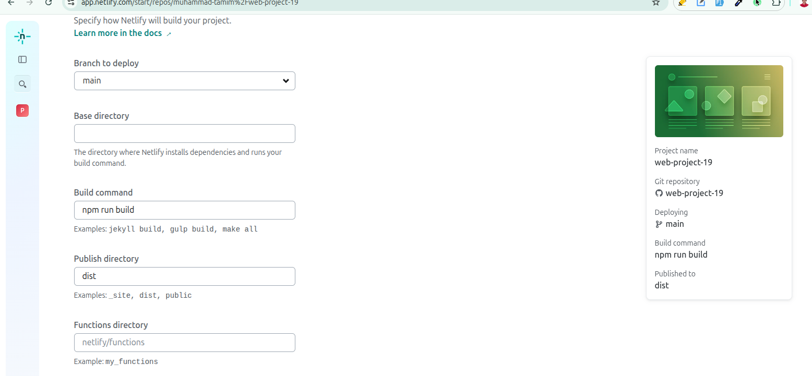

# Project Name: Knowledge Cafe

## Project Description:  
This is my very first React.js project. After learning the core concepts like props, hooks, conditional rendering, rendering lists, fetching data etc, I built this project. In this project, I fetch locally created JSON data using useEffect and store data using useEffect, then display the data using map. After that, I added bookmark and mark as read functionality.

Honestly, I really love React.js! It makes everything so much easier because of its component-based architecture and JSX.

If I had built this project with raw JavaScript, I would’ve had to manage a lot of unnecessary complexity. For example, manually selecting elements and updating them one by one. But in React, the whole process is simplified:

- I can use useState to store and update values.
- I can use useEffect to handle side effects.
- I can use JSX to write HTML directly inside JavaScript.


## features
This is a simple React Single Page Application (SPA) where I can:

- Add a blog to the reading list along with its reading time by clicking bookmarked icon.
- Remove a blog from the list by clicking Mark as Read button

- On the left side, I can see:
  - The total number of blogs I selected to read.
  - The total time I spent reading those blogs.
  - The headings of all selected blogs.


## Live Site Link:

## Project Video:


## What I Learned New while Building This Project:

1. How to add google fonts on react project:

```html
<!doctype html>
<html lang="en">

<head>
  <meta charset="UTF-8" />
  <link rel="icon" type="image/svg+xml" href="knowledge.png" />
  <meta name="viewport" content="width=device-width, initial-scale=1.0" />
  <title>Knowledge Cafe</title>

  <!-- google fonts -->
  <link rel="preconnect" href="https://fonts.googleapis.com">
  <link rel="preconnect" href="https://fonts.gstatic.com" crossorigin>
  <link href="https://fonts.googleapis.com/css2?family=Exo+2:ital,wght@0,100..900;1,100..900&display=swap"
    rel="stylesheet">

  <style>
    .exo-2 {
      font-family: "Exo 2", sans-serif;
      font-optical-sizing: auto;
      font-style: normal;
    }
  </style>
</head>

<body class="exo-2">
  <div id="root"></div>
  <script type="module" src="/src/main.jsx"></script>
</body>

</html>
```

2. How to add react hot toast: 

```jsx
import React, { Suspense, useEffect, useState, } from 'react';
import Navbar from './components/Navbar/Navbar';
import DisplayData from './components/DisplayData/DisplayData';
import { ErrorBoundary } from 'react-error-boundary';
import toast, { Toaster } from 'react-hot-toast';


const App = () => {

  const [singleData, setSingleData] = useState([])
  const [singleDataTime, setSingleDataTime] = useState(0)

  const [data, setData] = useState([])
  const [loading, setLoading] = useState(true)
  const [error, setError] = useState(null)

  useEffect(() => {
    fetch('./data.json')
      .then(res => res.json())
      .then(data => setData(data))
      .catch(err => setError(err))
      .finally(() => setLoading(false))

  }, [])


  const handleBookmarked = (clickedData) => {
    setSingleData([...singleData, clickedData])
    setSingleDataTime(clickedData.reading_time + singleDataTime)
    toast.success('Your Bookmarked is added!')
  }


  return (
    <>
      <Toaster position="top-right" />
      <div className='max-w-7xl mx-auto'>
        <Navbar></Navbar>

        <div className='grid grid-cols-12 mt-8 mb-52'>
          {/* left side */}
          <div className='col-span-8'>
            {loading && <div className='text-center '>
              <span className="loading size-16 loading-spinner"></span>
            </div>}
            {error && <p className='text-center text-3xl text-red-500'>{error.message}</p>}
            <DisplayData data={data} handleBookmarked={handleBookmarked}></DisplayData>
          </div>

          {/* right side */}
          <div className='col-span-4'>
            <p className='text-[#6047EC] mb-6 font-bold text-2xl border border-[#6047EC] bg-[#6047EC10] rounded-lg py-5 px-12'>
              Spent time on read : {singleDataTime} min
            </p>

            <div className='rounded-lg bg-[#11111105] p-7 '>
              <h3 className='text-2xl font-bold mb-6'>Bookmarked Blogs : {singleData.length}</h3>

              {
                singleData.map((data) => <p key={data.id} className='text-lg font-semibold p-5 mb-6 rounded-lg bg-white'>{data.title}</p>)
              }

            </div>
          </div>

        </div>

      </div>
    </>
  );
};

export default App;
```
3. How to deploy react project on netlify: 

Basically, there are two ways to deploy a React project on Netlify:
- Way 1: Using `npm run build` + Drag & Drop: 
  - Run npm run build → this creates a dist folder (which contains all your optimized production code).
  - Go to Netlify drag and drop your dist folder there.
- Way 2: Deploy directly using GitHub → Netlify
  - With this method, you don’t need to manually build dist folder using `npm run build` using vs code because Netlify do it for you.

 

## Challenges I faced while Building This Project:
1. I mistakenly add a comma on the very last object in my json data, so its give me error and it's take couple of minute to find: 

```json
[
    {
        "id": 1,
        "cover": "https: //i.ibb.co.com/zVXz2RgJ/conver1.png",
        "title": "How to get your first job as a self-taught programmer",
        "author_img": "https://i.ibb.co.com/JFvx4mYM/avatar2.png",
        "author": "Mr. Raju",
        "posted_date": "Mar 14 (4 Days ago)",
        "reading_time": 5,
        "hashtags": [
            "#beginners",
            "#programming"
        ]
    },
    {
        "id": 2,
        "cover": "https: //i.ibb.co.com/9HxCf4rc/cover2.png",
        "title": "JavaScript Objects for Absolute Beginners: A Fun Introduction",
        "author_img": "https://i.ibb.co.com/rKR1sRm1/avatar3.png",
        "author": "Mrs. Setara",
        "posted_date": "Mar 14 (4 Days ago)",
        "reading_time": 10,
        "hashtags": [
            "#javascript",
            "#coding",
            "#dev"
        ]
    },
    {
        "id": 3,
        "cover": "https: //i.ibb.co.com/B5M2SKYx/cover3.png",
        "title": "Component lifecycle in React — Class component vs Functional component",
        "author_img": "https://i.ibb.co.com/9kdp6P0d/avatar4.png",
        "author": "Mina Mostofa",
        "posted_date": "Mar 14 (4 Days ago)",
        "reading_time": 12,
        "hashtags": [
            "#mid_level",
            "#react"
        ]
    },
]
``` 


## Contact With Me: 

tamim.muhammad2005@gmail.com | +8801586090360 (WhatsApp)  

https://www.linkedin.com/in/tamim-muhammad
