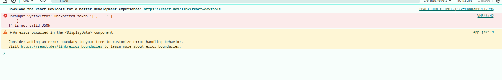

# Project Name: 

## Project Description:  

## Live Site Link:

## Project Video:

## Features:

## What I Learned New while Building This Project:

## Challenges I faced while Building This Project:
1. I mistakenly add a comma on the very last object in my json data, so its give me error and it's take couple of minute to find: 

```json
[
    {
        "id": 1,
        "cover": "https: //i.ibb.co.com/zVXz2RgJ/conver1.png",
        "title": "How to get your first job as a self-taught programmer",
        "author_img": "https://i.ibb.co.com/JFvx4mYM/avatar2.png",
        "author": "Mr. Raju",
        "posted_date": "Mar 14 (4 Days ago)",
        "reading_time": 5,
        "hashtags": [
            "#beginners",
            "#programming"
        ]
    },
    {
        "id": 2,
        "cover": "https: //i.ibb.co.com/9HxCf4rc/cover2.png",
        "title": "JavaScript Objects for Absolute Beginners: A Fun Introduction",
        "author_img": "https://i.ibb.co.com/rKR1sRm1/avatar3.png",
        "author": "Mrs. Setara",
        "posted_date": "Mar 14 (4 Days ago)",
        "reading_time": 10,
        "hashtags": [
            "#javascript",
            "#coding",
            "#dev"
        ]
    },
    {
        "id": 3,
        "cover": "https: //i.ibb.co.com/B5M2SKYx/cover3.png",
        "title": "Component lifecycle in React — Class component vs Functional component",
        "author_img": "https://i.ibb.co.com/9kdp6P0d/avatar4.png",
        "author": "Mina Mostofa",
        "posted_date": "Mar 14 (4 Days ago)",
        "reading_time": 12,
        "hashtags": [
            "#mid_level",
            "#react"
        ]
    },
]
``` 



## Contact With Me: 

tamim.muhammad2005@gmail.com | +8801586090360 (WhatsApp)  

https://www.linkedin.com/in/tamim-muhammad
